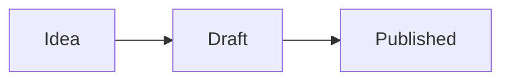

# Markdown reference

[← Manual](README.md)

Flint reads the same Markdown as Obsidian: CommonMark and GitHub Flavored Markdown, plus Obsidian's extensions (wikilinks, embeds, callouts, highlights, comments, block references, math and Mermaid).

## Text

| You write                | You get                                       |
| ------------------------ | --------------------------------------------- |
| `**bold**` or `__bold__` | **bold**                                      |
| `*italic*` or `_italic_` | _italic_                                      |
| `***bold italic***`      | **_bold italic_**                             |
| `~~strikethrough~~`      | ~~strikethrough~~                             |
| `==highlight==`          | highlighted text                              |
| `` `inline code` ``      | `inline code`                                 |
| `%%comment%%`            | nothing: comments are hidden when rendered    |
| `\*not italic\*`         | \*not italic\* (a backslash escapes a symbol) |

A blank line starts a new paragraph. Comments can span several lines:

```markdown
%%
Only visible while editing.
%%
```

## Headings

```markdown
# Heading 1

## Heading 2

### Heading 3

#### Heading 4

##### Heading 5

###### Heading 6
```

Headings build the note's **outline** (the **Outline** panel) and can be linked to with `[[Note#Heading]]`.

## Lists and tasks

```markdown
- Bullet item
  - Nested item

1. Numbered item
2. Another one

- [ ] A task to do
- [x] A finished task
```

Click a task's checkbox to tick it, in live preview, the reading view or an embed. Search can find tasks with `task-todo:` and `task-done:`.

## Links

```markdown
[[Note name]] link to a note
[[Note name|shown text]] link with different text
[[Note name#Heading]] link to a heading
[[Note name#^block-id]] link to a block
[[Folder/Note name]] link by path, when two notes share a name
[text](Note%20name.md) standard Markdown link to a note
[text](https://example.com) link to a web page
<https://example.com> bare web address
```

Links are resolved the way Obsidian resolves them. See [Links and the graph](links-and-graph.md).

## Embeds

An exclamation mark before a link shows the target inside the note:

```markdown
![[Other note]]               the whole note
![[Other note#Heading]]       one section
![[Other note#^block-id]]     one block
![[picture.png]]              an image
![[picture.png|300]]          an image 300 pixels wide
![[song.mp3]]                 an audio player (reading view)
![[video.mp4]]                a video player (reading view)
![[Books.base]]               a base
![[Board.canvas]]             a canvas
      standard Markdown image
 image from the web
```

Embedded notes can embed others, up to three levels deep.

## Block references

Add `^id` at the end of a paragraph, list item or other block to give it an id:

```markdown
Flint keeps notes as plain files. ^plain-files
```

Then link to it with `[[Note#^plain-files]]` or embed it with `![[Note#^plain-files]]`. When you pick a block from autocomplete (`[[Note#^` or `[[^^`) and it has no id yet, Flint adds one for you.

## Tags

```markdown
#idea #project/flint #2026-plans
```

- A tag starts with `#`, can hold letters, numbers, `_`, `-` and `/`, and needs at least one character that isn't a number.
- `/` makes nested tags. A search for `tag:#project` also finds `#project/flint`.
- Tags inside code, links and math are ignored.
- The `tags` property in frontmatter adds tags too.

## Quotes and callouts

```markdown
> A plain quote.

> [!note]
> A callout with a title taken from its type.

> [!warning] Watch out
> A callout with its own title.

> [!tip]- Folded
> Starts closed; click the title to open it. Use `+` instead of `-` to start open.
```

Callout types, as in Obsidian:

- `note`, `info`, `todo`
- `abstract`, `summary`, `tldr`
- `tip`, `hint`, `important`
- `success`, `check`, `done`
- `question`, `help`, `faq`
- `warning`, `caution`, `attention`
- `failure`, `fail`, `missing`
- `danger`, `error`
- `bug`
- `example`
- `quote`, `cite`

Unknown types show as a note.

## Code

````markdown
Inline `code`.

```python
def greet(name):
    return f"Hello, {name}"
```
````

Code blocks get syntax highlighting for the language named after the opening fence, and a **Copy** button in the reading view.

## Tables

```markdown
| Name  |   Role   | Score |
| :---- | :------: | ----: |
| Ada   | Engineer |    98 |
| Grace | Admiral  |    95 |
```

The colons set each column's alignment: left, center and right. In live preview tables are edited as a grid (see [Tables](editor.md#tables)).

## Footnotes

```markdown
Flint is written in Rust and TypeScript.[^stack]

[^stack]: With Tauri, Svelte and CodeMirror.
```

In the reading view, footnote numbers link to the notes at the bottom and back.

## Math

Math uses LaTeX and renders with MathJax:

```markdown
Inline: $e^{i\pi} + 1 = 0$

Block:

$$
\int_0^\infty e^{-x^2}\,dx = \frac{\sqrt{\pi}}{2}
$$
```

## Mermaid diagrams

````markdown

````

Flowcharts, sequence diagrams, Gantt charts, class diagrams and every other diagram type Mermaid supports. Diagrams follow the light or dark theme.

## Horizontal rules and line breaks

`---` on a line of its own draws a horizontal rule.

A single line break inside a paragraph joins the two lines when the note is rendered. To force a break, end the line with two spaces or `<br>`, or leave a blank line to start a new paragraph.

## HTML

Basic inline HTML such as `<kbd>`, `<sub>`, `<sup>` and `<br>` is rendered.

## Frontmatter

YAML between `---` lines at the top of a note holds its properties. See [Properties](editor.md#properties-frontmatter).
